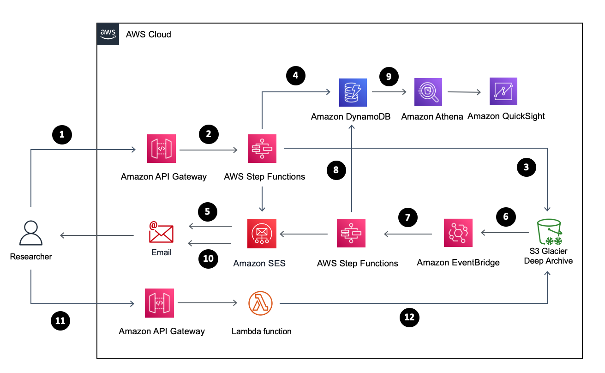

## Orchestrating S3 Glacier Deep Archive object retrieval using Step Functions

### Business use case
Consider a research institute that stores backups on S3 Glacier Deep Archive. The backups are maintained in S3 Glacier Deep Archive for redundancy. The institute has multiple researchers with one central IT team. When a researcher requests an object from Glacier Deep Archive, the central IT team retrieves it and charges the corresponding research group for retrieval and data transfer costs.

Researchers are the end-users and do not operate on AWS. They run their computing clusters on-premises and depend on the central IT team to provide them with the restored archive. A member of the research team requesting an object retrieval provides the following information to the central IT team: 
1.	Object key to be restored.
2.	The number of days the researcher needs the object accessible for download. 
3.	Researcher’s Email Address.
4.	Retrieve within 12 or 48 hours SLA. This determines whether “Standard” or “Bulk” retrieval respectively.

The following overall architecture explains the setup on AWS and the interaction between a researcher and the central IT team’s architecture.

### Architecture overview


 
1.	The researcher uses a [front-end application](website-content/index.html) to request object retrieval from S3 Glacier Deep Archive.
2.	Amazon API Gateway synchronously invokes AWS Step Functions Express workflow.
3.	Step Functions initiates RestoreObject from S3 Glacier Deep Archive.
4.	Step Functions stores the metadata of this retrieval in an Amazon DynamoDB table.
5.	Step Functions uses Amazon SES to email the researcher about archive retrieval initiation.
6.	Upon completion, S3 sends the RestoreComplete event to Amazon EventBridge.
7.	EventBridge rule triggers another Step Function for post-processing after the restore is complete.
8.	A Lambda function inside the Step Function calculates the estimated cost (retrieval and data transfer out) and updates existing metadata in the DynamoDB table.
9.	Sync data from DynamoDB table using Amazon Athena Federated Queries to generate reports dashboard in Amazon QuickSight.
10.	Step Function uses SES to email the researcher with cost details.
11.	Once the researcher receives an email, the researcher uses the front-end application to call the `/download` API endpoint.
12.	Amazon API Gateway invokes a Lambda function that generates a pre-signed S3 URL of the retrieved object and returns it in the response.

### Setup
To run the sample application, you need:
1.	CDK v2
2.	Node.js
3.	npm

Clone the repository, then run:

```bash
cd sam/app-glacier-deep-archive-retrieval
```

To deploy the application, run:

```bash
cdk deploy --all
```

### Considerations
Take the following considerations with the above approach:
1.	Start the object retrieval in the same region as the region of the archived object. 
2.	S3 Glacier Deep archive only supports standard and bulk retrievals. 
3.	Enable the “Object Restore Completed” event notification on the S3 bucket with the Glacier Deep Archive object.
4.	The researcher confirms the SES Email subscription for the supplied email address.
5.	Use a Lambda function for Price List GetProducts API as the service endpoints are available in specific regions.

### Cleanup
To clean up the infrastructure, run:

```bash
cdk destroy --all
```