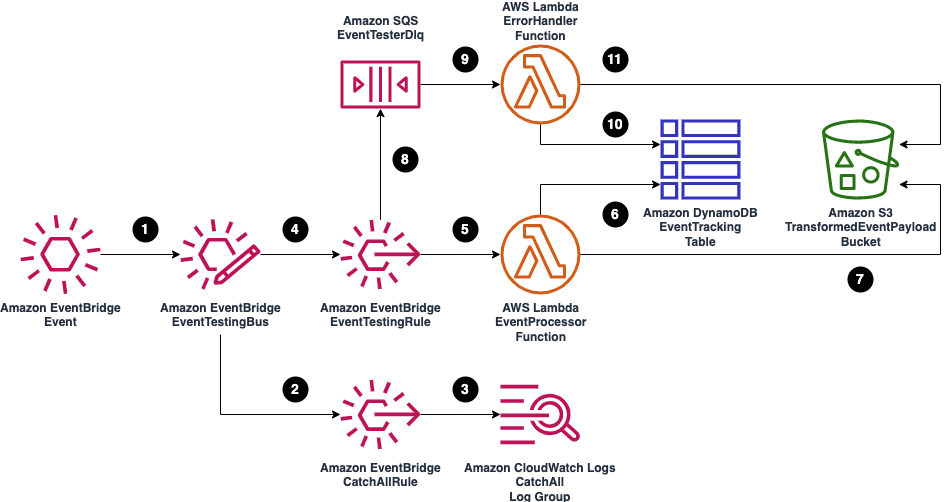
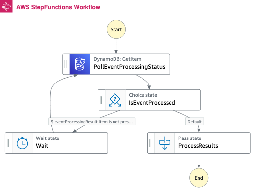
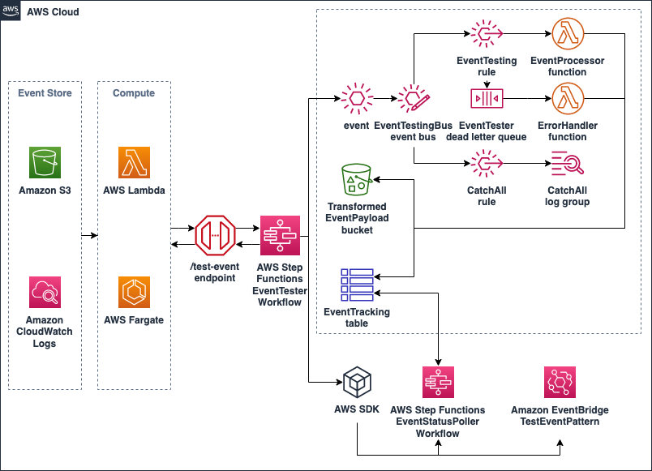

# Testing Amazon EventBridge events using AWS Step Functions

[Amazon EventBridge](https://aws.amazon.com/eventbridge/) is a serverless event bus that can be used to ingest and process events from a variety of sources, such as AWS services and SaaS applications. With EventBridge, developers can build loosely coupled and independently scalable event-driven applications.
One of the challenges with EventBridge is identifying when events are not able to reach the desired destination. This can be caused by multiple factors, such as:

1. Event pattern does not match the event rule
1. Event transformer failure
1. Event destination expects a different payload (for example, [API destinations](https://aws.amazon.com/blogs/compute/using-api-destinations-with-amazon-eventbridge/)) and returns an error

EventBridge [sends metrics to Amazon CloudWatch](https://docs.aws.amazon.com/eventbridge/latest/userguide/eb-monitoring.html), which allows for the detection of failed invocations on a given event rule. You can also use EventBridge rules with a dead-letter queue (DLQ) to identify any failed event deliveries. The messages delivered to the queue contain additional metadata such as error codes, error messages, and the target ARN for debugging.

However, understanding why events fail to deliver is still a manual process. Checking CloudWatch metrics for failures, and then the DLQ takes time. This is evident when developing new functionality, when you must constantly update the event matching patterns and event transformers, and run tests to see if they provide the desired effect. EventBridge [sandbox](https://aws.amazon.com/about-aws/whats-new/2022/03/amazon-eventbridge-rule-filtering-transformation-console/) functionality can help with manual testing but this approach does not scale or help with automated event testing.

This post demonstrates how to automate testing for EventBridge events. It uses [AWS Step Functions](https://aws.amazon.com/step-functions/) for orchestration, along with [Amazon DynamoDB](https://aws.amazon.com/dynamodb/) and [Amazon S3](https://aws.amazon.com/s3/) to capture the results of your events, [Amazon SQS](https://aws.amazon.com/sqs/) for the DLQ, and [AWS Lambda](https://aws.amazon.com/lambda/) to invoke the workflows and processing.

## Overview

Using the solution provided in this post users can track events from its inception to delivery and identify where any issues or errors are occurring. This solution is also customizable, and can incorporate integration tests against events to test pattern matching and transformations.


At the high level:

1. The event testing workflow is exposed via an API Gateway endpoint, and users can send a request.
1. This request is validated and routed to a Step Functions EventTester workflow, which performs the event test.
1. The EventTester workflow creates a sample event based on the received payload, and performs multiple tests on the sample event.
1. The sample event is matched against the rule that is being tested. The results are stored in an Amazon DynamoDB EventTracking table, and the transformed event payload is stored in the TransformedEventPayload Amazon S3 bucket.
1. The EventTester workflow has an embedded AWS Step Functions workflow called EventStatusPoller. The EventStatusPoller workflow polls the EventTracking table.
1. The EventStatusPoller workflow has a customizable 10-second timeout. If the timeout is reached, this may indicate that the event pattern does not match. EventBridge tests if the event does not match against a given pattern, using the AWS SDK for EventBridge.
1. After completing the tests, the response is formatted and sent back to the API Gateway. By default, the timeout is set to `15` seconds.
1. API Gateway processes the response, strips the unnecessary elements, and sends the response back to the issuer. You can use this response to verify if the test event delivery is successful, or identify the reason a failure occurred.

## EventTester workflow

After an API call, this event is sent to the EventTester express workflow. This orchestrates the automated testing, and returns the results of the test.


In this workflow:

1. The test event is sent to EventBridge to see if the event matches the rule and can be transformed. The result is stored in a DynamoDB table.
2. The `PollEventStatus` synchronous Express Workflow is invoked. It polls the DynamoDB table until a record with the event ID is found or it reaches the timeout. The configurable timeout is `15` seconds by default.
3. If a record is found, it checks the event status.

From here, there are three possible states. In the first state, if the event status has succeeded:

4. The response from the `PollEventStatus` workflow is parsed and the payload is formatted.
5. The payload is stored in an S3 bucket.
6. The final response is created, which includes the payload, the event ID, and the event status.
7. The execution is successful, and the final response is returned to the user.

In the second state, if no record is found in the table and the `PollEventStatus` workflow reaches the timeout:

8. The most likely explanation for reaching the timeout is that the event pattern does not match the rule, so the event is not processed. You can build a test to verify if this is the issue.
9. From the EventBridge SDK, the `TestEventPattern` call is made to see if the event pattern matches the rule.
10.	The results of the `TestEventPattern` call is checked.
11.	If the event pattern does not match the rule, then the issue has been successfully identified and the response is created to be sent back to the user. If the event pattern matches the rule, then the issue has not been identified.
12.	The response shows that this is an unexpected error.

In the third state, this acts as a catch-all to any other errors that may occur:

13. The response is created with the details of the unexpected error.
14. The execution has failed, and the final response is sent back to the user.

## Event testing process

The following diagram shows how events are sent to EventBridge and their results are captured in S3 and DynamoDB. This is the first step of the `EventTester` workflow:



When the event is tested:

1. The sample event is received and sent to the EventBridge custom event bus.
1. A `CatchAll` rule is triggered, which captures all events on the custom event bus.
1. All events from the `CatchAll` rule are sent to a CloudWatch log group, which allows for an original payload inspection.
1. The event is also propagated to the `EventTesting` rule. The event is matched against the rule pattern, and if successful the event is transformed based on the transformer provided. (The event pattern and event transformer are provided via an `IEventBridgeEvent` interface implementation, as seen in [resource-state-changed-event.ts](./cdk-app/lib/events/impl/resource-state-changed-event.ts). To customize for your testing, update the event implementation and then redeploy the stack)
1. If the event is matched and transformed successfully, the Lambda function [EventProcessor](./src/lambdas/event-processor/index.ts) is invoked to process the transformed event payload. You can add additional custom code to this function for further testing of the event (for example, API integration with the transformed payload).
1. The event status is updated to `SUCCESS` and the event metadata is saved to the `EventTracking` DynamoDB table.
1. The transformed event payload is saved to the `TransformedEventPayload` S3 bucket.
1. If there’s an error, EventBridge sends the event to the SQS DLQ.
1. The Lambda function [ErrorHandler]./src/lambdas/error-handler/index.ts) polls the DLQ, and process the errors in batches.
1. The event status is updated to `ERROR` and the event metadata is saved to the `EventTracking` DynamoDB table.
1. The event payload is saved to the `TransformedEventPayload` S3 bucket.

## EventStatusPoller workflow

The `EventStatusPoller` workflow will continuously poll the DynamoDB table until a new record appears or it reaches the timeout. This is the second step of the `EventTester` workflow.



When the poller runs:

1. It checks the DynamoDB table to see if the event has been processed.
1. The result of the poll is checked.
1. If the event has not been processed, the workflow loops and poll the Amazon DynamoDB table again.
1. If the event has been processed, the results of the event are passed to next step in the Event Testing workflow.

Visit [Composing AWS Step Functions to abstract polling of asynchronous services](https://aws.amazon.com/blogs/compute/composing-aws-step-functions-to-abstract-polling-of-asynchronous-services/) for additional details.

## Testing at scale



The EventTester workflow uses [Express Workflows](https://docs.aws.amazon.com/step-functions/latest/dg/concepts-standard-vs-express.html), which can handle testing high volume event workloads. For example, you can run the solution against large volumes of historical events stored in S3 or CloudWatch.

This can be achieved by using services such as Lambda or [AWS Fargate](https://aws.amazon.com/fargate/) to read the events in batches and run tests simultaneously. To achieve optimal performance, some performance tuning may be required depending on the scale and events that are being tested.

In this setup, the DynamoDB table is provisioned with `5` read capacity units and `5` write capacity units, to minimize the cost of the demo. In the case of a production system, consider using [on-demand capacity](https://docs.aws.amazon.com/amazondynamodb/latest/developerguide/HowItWorks.ReadWriteCapacityMode.html#HowItWorks.OnDemand), or update the provisioned table capacity.

### Event sampling


In this implementation, the EventBridge `EventTester` can be used to periodically sample events from your system for testing:

1. Any existing rules that must be tested are provisioned via the AWS CDK.
1. The sampling rule is added to an existing event bus, and has the same pattern as the rule that is tested. This filters out events that are not processed by the tested rule.
1. SQS queue is used for buffering.
1. Lambda function processes events in batches, and can optionally implement sampling. For example, setting a `10%` sampling rate will take one random message out of 10 messages in a given batch.
1. The event is tested against the endpoint provided. Note that the EventTesting rule is also provisioned via AWS CDK from the same code base as the tested rule. The tested rule is replicated into the EventTesting workflow.
1. The result is returned to a Lambda function, and is then sent to CloudWatch Logs.
1. A metric is set based on the number of `ERROR` responses in the logs.
1. An alarm is configured when the `ERROR` metric crosses a provided threshold.

This sampling can complement existing [metrics](https://docs.aws.amazon.com/eventbridge/latest/userguide/eb-monitoring.html) exposed for EventBridge via CloudWatch.

## Testing the solution

### Prerequisites

To follow the solution walkthrough, you will need to:

1. An [AWS Account](https://aws.amazon.com/free/).
1. Set up the [AWS CLI](https://docs.aws.amazon.com/cli/latest/userguide/getting-started-install.html) to deploy resources to your account.
1. Have the appropriate [AWS Credentials](https://docs.aws.amazon.com/cli/latest/userguide/cli-configure-files.html) configured.
1. [Node.js 14](https://nodejs.org/en/download/), [npm](https://www.npmjs.com/), [Typescript](https://www.typescriptlang.org/), and [jq](https://stedolan.github.io/jq/download/) installed.
1. Install [Docker](https://docs.docker.com/get-docker/) on your machine.
1. Bootstrap your environment with [AWS CDK](https://docs.aws.amazon.com/cdk/v2/guide/bootstrapping.html).

### Solution Walkthrough

You can use [AWS Cloud9](https://aws.amazon.com/cloud9/), or your preferred IDE, to deploy the solution. Refer to the cleanup section of this post for instructions to delete the resources to stop incurring any further charges.

1. Clone the project repository to your local machine.

```zsh
git clone https://github.com/aws-samples/aws-stepfunctions-examples.git
```

2. Navigate to the solution folder.

```zsh
cd cdk/eventbridge-event-tester/
```

3. Build the source files.

```zsh
./build-src.sh
./build-cdk.sh
```

4. Change your current working directory to the cdk-app folder.

```zsh
cd cdk-app
```

5. Set the event bus and the namespace you want to use. If you have an existing event bus you can provide the ARN, otherwise leave it blank to create a new event bus.

```zsh
NAMESPACE='<NAMESPACE>'
```

6. Compile the stack and store the stake name in a variable.

```zsh
STACK_NAME=$(cdk list)
```

7. Deploy the solution stack.

```zsh
cdk deploy $STACK_NAME \
--context namespace=$NAMESPACE \
--context eventTesterWorkflowTimeout=15 \
--context eventStatusPollerWorkflowTimeout=10
```

You shoudl receive an output similar to the following:


8. Event Testing workflow is exposed via an Amazon API Gateway. Current setup assumes an endpoint per event. [event-tester-stack](./cdk-app/lib/event-tester-stack.ts) provides a single endpoint, named `resource-state-changed-event`. Sample event implementation is provided under [resource-state-changed-event.ts](./cdk-app/lib/events/impl/resource-state-changed-event.ts). Inspect the [resource-state-changed-event.ts](./cdk-app/lib/events/impl/resource-state-changed-event.ts). Two main methods that we are interested in are `pattern()` and `transformer()`:

```typescript
pattern(): EventPattern {
  return {
    // we are interested in a particular data source
    source: [this._config.eventSource],
    ...
  }
}

transformer(): RuleTargetInput {
  return RuleTargetInput.fromObject({
    // event id is required
    eventId: EventField.eventId,
    ...
  });
}
```

9. Inspect the method content. Navigate to the event rule deployed by the stack. Go to Amazon EventBridge [console](https://console.aws.amazon.com/events/home). Select `Rules` under `Events`. Select the event bus deployed by the stack, and select the `Event Testing Rule`. Inpect the event pattern, it shoud look similar to the one below:

```jsonc
{
  // if the <NAMESPACE> specified is 'octank`
  "source": ["com.octank.www"],
  "detail": {
    "resourceName": [{
      "exists": true
    }],
    "state": {
      "reason": [{
        "exists": true
      }],
      "value": ["ALARM"]
    },
    "previousState": {
      "value": ["OK"]
    }
  }
}
```

10. Notice that the pattern corresponds to the `pattern()` method of the [resource-state-changed-event.ts](./cdk-app/lib/events/impl/resource-state-changed-event.ts).

11. Select `Targets` and click `view transformer`. inspect the transformer content and notice that it corresponds to the `transformer()` method of the [resource-state-changed-event.ts](./cdk-app/lib/events/impl/resource-state-changed-event.ts.ts).

12. Store the test url for the event in the console variable:

```zsh
API_URL=$(aws cloudformation describe-stacks \
--stack-name $STACK_NAME \
--query "Stacks[0].Outputs[?OutputKey=='ResourceStateChangedUrl'].OutputValue" \
--output)
```

13. It is possible to add extra enpoints by creating a custom event that implements `IEventBridgeEvent` and  `ITestableEvent` interfaces. After that `StateMachineApiResource` has to be created:

```typescript
const event = eventFactory.customEvent(); // custom event implementation

const customerApiResource = new StateMachineApiResource(this, 'custom-api-resource', {
      api: eventBridgeTestingApi.api,
      model: eventBridgeTestingApi.model,
      requestValidator: eventBridgeTestingApi.requestValidator,
      role: eventBridgeTestingApi.role,
      // api resource is built based on the custom event
      event: event,
      eventBus: eventBus,
      config: config
});
```

14. The API has model validation build in, and expects the payload in the following format:

```jsonc
{
    "detail-type": "<EVENT_DETAIL_TYPE>",
    "source": "<EVENT_SOURCE>",
    "detail": {
        // arbitrary object
    }
}
```

Have a look at [resource-state-changed-event.ts](./cdk-app/lib/events/impl/resource-state-changed-event.ts) `sampleEventPayload()` method for a payload example.

The API returns the response in the following format:

```jsonc
{
  "eventId": "<ID_OF_THE_EVENT>", // this is the id of a sample event produced by the testing EventBus
  "payload": "<TRANFORMED_EVENT_PAYLOAD_STRING>", // note that payload is a string
  "status": "SUCCESS", // SUCCESS OR FAILURE
  "errorMessage": "", // empty if SUCCESS
  "errorCode": "" // empty if SUCCESS
}
```

There are multiple options to test the implementation. A sample `jest` test is provided under [event-bridge.test.ts](./cdk-app/test/event-bridge.test.ts).

15. Test that the solution has been deployed correctly.

```zsh
npm run test -- event-bridge --url=$API_URL --namespace=$NAMESPACE
```


The api response should be similar to the following

```jsonc
{
  "eventId": "89fd3266-5b43-cac4-7145-11c694bc6b28",
  "payload": "<PAYLOAD_STRING>",
  "errorMessage": "",
  "errorCode": "",
  "status": "SUCCESS"
}
```

16. Modify the `transformer()` method of the [resource-state-changed-event.ts](./cdk-app/lib/events/impl/resource-state-changed-event.ts). It should look like the following:

```typescript
transformer(): RuleTargetInput {
  return RuleTargetInput.fromObject({
    // event id is required
    eventId: EventField.eventId,
    ...
    detail: {
      ...
      custom: '<aws.events.event.json>' // this will break the transformer
    }
  });
}
```

17. Rebuild the stack:

```zsh
./../build-cdk.sh
```

18. Redeploy the stack:

```zsh
cdk deploy $STACK_NAME \
--context namespace=$NAMESPACE \
--context eventTesterWorkflowTimeout=15 \
--context eventStatusPollerWorkflowTimeout=10
```

19. Run the test again:

```zsh
npm run test -- event-bridge --url=$API_URL --namespace=$NAMESPACE
```

20. The test should fail this time. Inspect the response returned fromt he API:

```jsonc
{
  "eventId": "d3030765-02d4-e140-8dab-fdfe6c20b68d",
  "payload": "<PAYLOAD_STRING>",
  "errorMessage": "Invalid input for target.",
  "errorCode": "INVALID_JSON",
  "status": "ERROR"
}
```

21. The resason the test fails is because the event rule transfomer produces a payload that is not a valid `json` object. Inspect the `payload` string for further details.

### Cleanup

To clean up the resources provisioned from the solution:

1. Delete the CDK stack.

```zsh
cdk destroy $STACK_NAME
```

2. Delete orphan CloudWatch logs. Navigate to Amazon CloudWatch [console](https://console.aws.amazon.com/cloudwatch/home). Select `Log groups` under `Logs`. Locate log groups created by the cdk. Log groups should start from `aws/lambda/EventTesterStack...`. For example:


Delete the log groups.

### Cost considerations

For Step Functions, this example uses the Express Workflow type because of the API Gateway integration. Make sure you follow the cleanup process to avoid any unexpected charges.

## Conclusion

This blog post outlines how to use Step Functions, Lambda, SQS, DynamoDB, and S3 to create a workflow that automates the testing of your EventBridge events. With this example, you can send events to the EventBridge Event Tester endpoint to either verify that event delivery is successful, or identify the root cause for event delivery failures.

For more serverless learning resources, visit [Serverless Land](https://serverlessland.com/).
