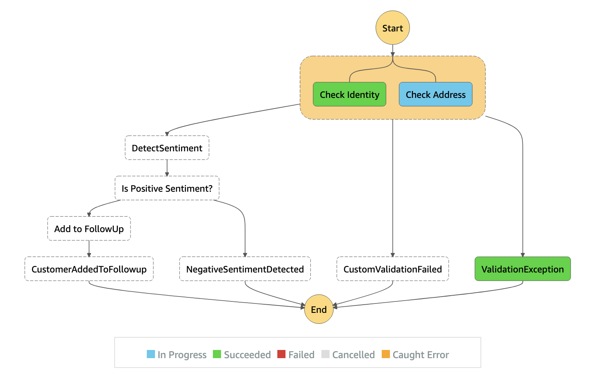

# AWS Step Functions Local Testing with mocking

This is a sample application which showcases how to use Step Functions local testing using mock configs. Using mock config allows a developer to mock the output of service integrations that are present in a state machine.

Developers can provide a valid sample output from the service call API that is present in the state machine as mock data. This allows developers to test the behavior of the state machine in isolation.

Multiple testing scenarios can be handled in a `MockConfigFile.json`. Let's dive deeper to understand how it works.

## Use Step Functions Local Mock Config

`MockConfigFile.json` has the following structure


1. Mock Configurations for your state machines
2. Name of the State Machine under test
3. The number of test cases per the surrounding state machine that is under test
4. Name of the test case
5. Mapping of State (string match) with the supplied mock response
6. Mock responses used by all of the state machines under test
7. Mock Response string matching the value from #5
8. Mock response for the first invocation of that state. Subsequent invocations can be referred as "1", "2", and so on. In case of retries, it can be referred as "0-2" (for 3 failed retries) and another json object with key "3" mocking the successful response. This is assuming that the state machine state has Retry block with `MaxRetries` set to 4
9. Return the mock response that matches the expected response from the task (response is not validated by Step Functions Local)

### Prerequisites

You will need below items to successfully test and deploy:

 - [AWS CLI](https://aws.amazon.com/cli/)
 - [AWS SAM CLI](https://docs.aws.amazon.com/serverless-application-model/latest/developerguide/serverless-sam-cli-install.html)
 - [Docker](https://docs.docker.com/get-docker/)


### Running Local tests with mock

After cloning this repository, `cd` to it's root directory:

```bash
cd app-local-testing-mock-config
```

Following the user guide, you can either run Step Functions local [as a JAR](https://docs.aws.amazon.com/step-functions/latest/dg/sfn-local-computer.html) or as a [Docker container](https://docs.aws.amazon.com/step-functions/latest/dg/sfn-local-docker.html). Steps below will focus on the docker container approach.

Following the user guide for Step Functions local testing using docker container, pull the latest docker image as:

```bash
docker pull amazon/aws-stepfunctions-local
```

Running the container image:

```bash
docker run -p 8083:8083 \
  --mount type=bind,readonly,source=$(pwd)/statemachine/test/MockConfigFile.json,destination=/home/StepFunctionsLocal/MockConfigFile.json \
  -e SFN_MOCK_CONFIG="/home/StepFunctionsLocal/MockConfigFile.json" \
  amazon/aws-stepfunctions-local
```

### Testing the application

Create the state machine in State Functions local:

```bash
aws stepfunctions create-state-machine \
  --endpoint-url http://localhost:8083 \
  --definition "$(cat ./statemachine/local_testing.asl.json)" \
  --name "LocalTesting" \
  --role-arn "arn:aws:iam::123456789012:role/DummyRole"
```

#### Happy Path Scenario

Trying to execute happy path where no error is faced. Note that the below CLI command appends the test case `#HappyPathTest` to state machine ARN. This name matches with the test case name provided in `MockConfigFile.json`


```bash
aws stepfunctions start-execution \
  --endpoint http://localhost:8083 \
  --name executionWithHappyPathMockedServices \
  --state-machine arn:aws:states:us-east-1:123456789012:stateMachine:LocalTesting#HappyPathTest \
  --input "$(cat ./events/sfn_valid_input.json)"
```

**Negative Sentiment Scenario**


```bash
aws stepfunctions start-execution \
  --endpoint http://localhost:8083 \
  --name executionWithNegativeSentimentMockedServices \
  --state-machine arn:aws:states:us-east-1:123456789012:stateMachine:LocalTesting#NegativeSentimentTest \
  --input "$(cat ./events/sfn_valid_input.json)"
```

#### Error Scenario Testing

**Custom Validation Error Scenario**


```bash
aws stepfunctions start-execution \
  --endpoint http://localhost:8083 \
  --name executionWithCatchCustomErrorPathMockedServices \
  --state-machine arn:aws:states:us-east-1:123456789012:stateMachine:LocalTesting#CustomValidationFailedCatchTest \
  --input "$(cat ./events/sfn_valid_input.json)"
```

**Exception Path**



```bash
aws stepfunctions start-execution \
  --endpoint http://localhost:8083 \
  --name executionWithCatchRuntimeExceptionPathMockedServices \
  --state-machine arn:aws:states:us-east-1:123456789012:stateMachine:LocalTesting#ValidationExceptionCatchTest \
  --input "$(cat ./events/sfn_valid_input.json)"
```

You can check the execution history by running the command:

```bash
aws stepfunctions get-execution-history \
  --endpoint http://localhost:8083 \
  --execution-arn arn:aws:states:us-east-1:123456789012:execution:LocalTesting:executionWithCatchRuntimeExceptionPathMockedServices
```

## Deploy the sample application

This application uses AWS SAM. Deploy the sample application in your AWS account in order to test the state machine from console. Run:

```bash
sam build && sam deploy --guided
```

For subsequent build and deploys:

```bash
sam build && sam deploy
```

## Cleanup

To cleanup the infrastructure:

```bash
sam delete
```