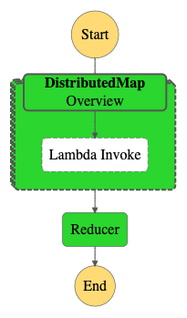
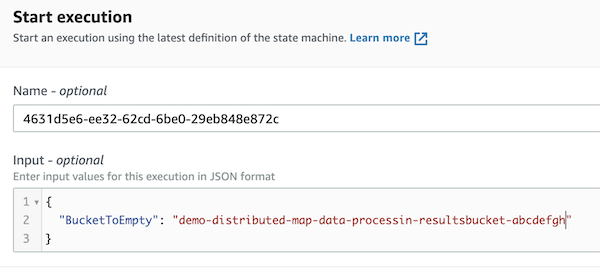

# Step Functions Distributed Map weather analysis

This is a SAM application that processes all
[37+ GB of NOAA Global Surface Summary of Day](https://registry.opendata.aws/noaa-gsod/). The
application code in this example finds the weather station that has _the higest average temperature
on the planet each month_. This data set is interesting for a few reasons:

1. The data is organized by station/day. Each weather station will have a single record with
   averages per _day_. This example Step Function workflow will find the highest avearge temperature
   across all stations by _month_. That is, it answers the question: "What place on earth recorded
   the hightest average daily temperature within a given month?"
2. There are over 558,000 CSV files in the data set at over 37 GB. The average CSV file side is 66.5
   KB.
3. The CSV files are relatively simple to understand and parse.

## Design

This implementation uses a Lambda map function (using a Distributed Map state from Step Functions)
and a Lambda reducer function. The reducer function performs a final aggregation and writes the
results to DynamoDB.

The reducer function is necessary because two child workflows in the Distributed Map run may process
and find a high temperature for the same day. For example, child worflow 1 may find that Seattle,
Washington, USA had the highest temperature on "2022-07" (July, 2022) while child workflow 2 finds
that Jahra, Kuwait had the highest temperature on "2022-07". The reducer function will take a final
pass through the outputs from all of the child workflows to find the correct highs.



**Using a Distributed Map batch size of 500 this workflow completes in approximately 90-150 seconds.**

## Input data

Each CSV file has the following format (many columns not shown):


The mapper Lambda function will read each line into a dictionary and use the `DATE` and `TEMP`
fields to find the the `STATION` with the highest average daily temperature in a month.

## Output

Results are written to DynamoDB in the same way they are represented in CSV, using the same columns.
Each row is unique by `YYYY-MM`.


## Running this in your own account

> ## NOTE: This demo can incur charges in your AWS acount once you are beyond the free tier. The charges are on the order $0.10 for one run.

This demo needs to run in the `us-east-1` AWS region.

To run this demo in your own account:

1. Deploy this example using AWS SAM in the `us-east-1` region. Look at the `Outputs` after you
   deploy it since you will need some of these in future steps.


2. Run the `CopyNOAAS3DataStateMachine` workflow. The `input` into the worflow doesn't matter.
   Running this workflow will copy the public NOAA data into your own bucket.
   **NOTE: THIS TAKES ~45-60 min to complete**. If you would like to copy a subset of the files, simply
   stop the execution in the AWS console.
3. Run the `NOAAWeatherStateMachine` workflow which will read the data you just copied and process
   it as described above, and write theh results to DynamoDB.
4. Look at the DynamodDB table contents in the AWS console to see the final results. Also look at
   the processing time for the `NOAAWeatherStateMachine` run, which should be on the order of 90-150
   seconds, depending on how much data you copied.

## Cleaning up

### Emptying S3 buckets

The SAM application will create a state machine called `DeleteNOAADataStateMachine`. Before you can
delete all of the resources, you need to empty two buckets:

- `NOAADataBucket` where you copied the public NOAA data
- `StateMachineResultsBucket` where the distributed map results are written

Run the `DeleteNOAADataStateMachine` twice for each bucket. Use the following payload to tell the
workflow which S3 bucket to empty.

```json
{
  "BucketToEmpty": "value-of-the-StateMachineResultsBucket-from-outputs"
}
```

and:

```json
{
  "BucketToEmpty": "value-of-the-NOAADataBucket-from-outputs"
}
```

This is what it looks like in the console:



Because the `ListObjectsV2` API returns a maximum of 1000 S3 objects, the workflow will work
page-by-page to both copy and delete.

_Note, this workflow only has permission to delete objects from these two buckets, so there is no
danger in accidentally emptying another bucket._

### SAM delete

Once the buckets are emptied, simply run `sam delete` and answer `y` to any questions.
